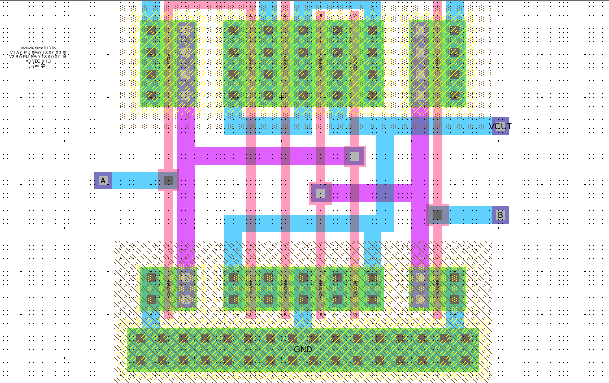
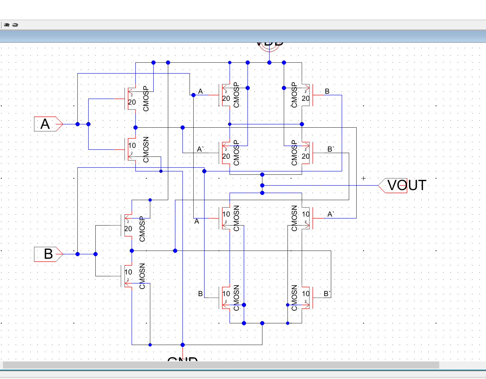
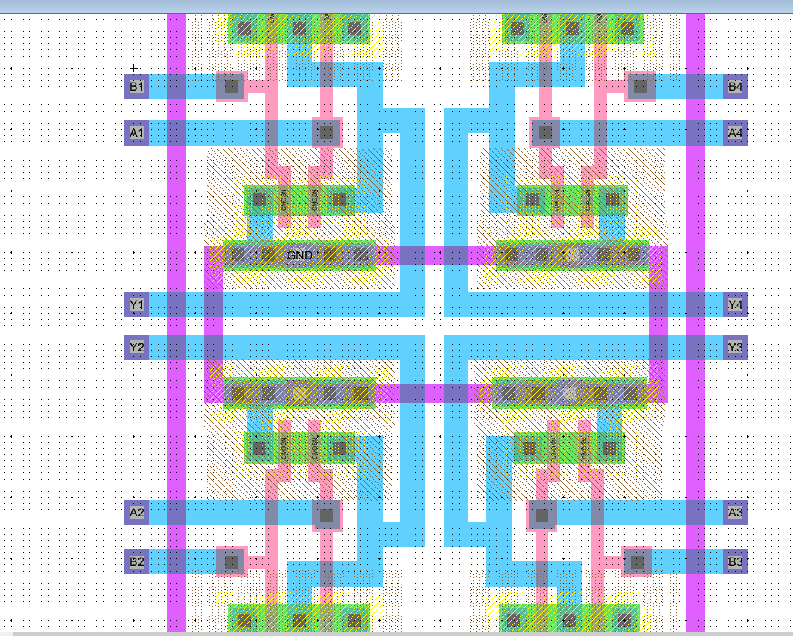
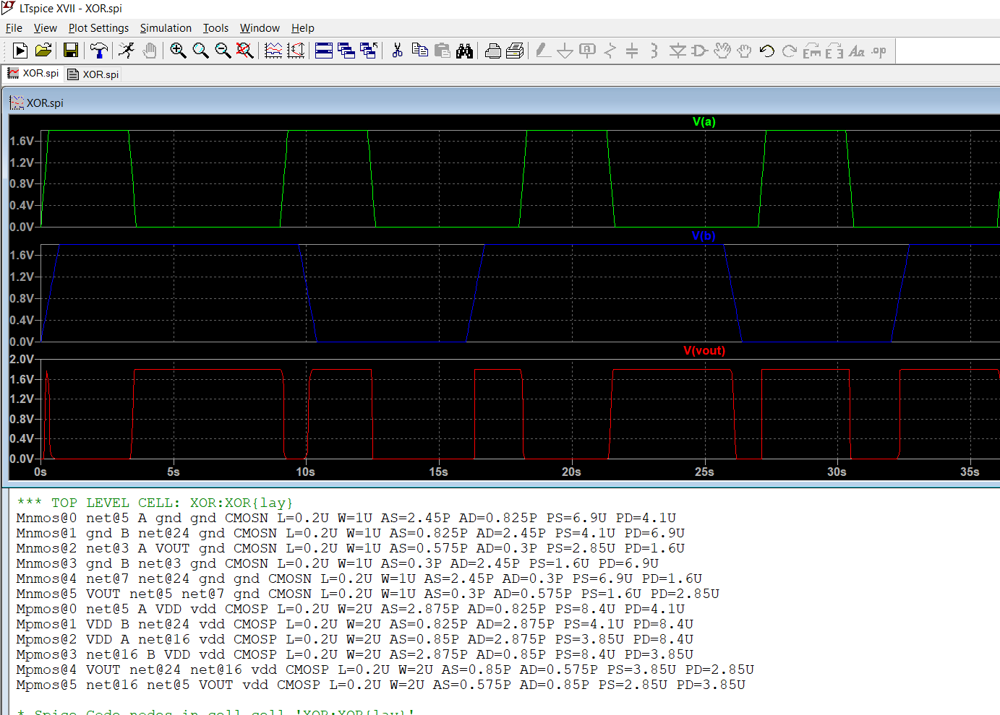

# Basic_Gates_Layout
Baisc Gates Layout using Electric VLSI and LT-Spice. This is my learning repository where in I've shared what i did and learnt.  

#VLSI #Electric #LT-Spice #Layout 
***
In this Repository I've posted the layout of basic gates 
**1)NOT 
2)AND 
3)NAND 
4)NOR 
5)OR 
6)XOR **

The layout and schematic images are available in the folders,here are the snipetts of the same. 
Any sugesstion's are open and im eager to learn and explore more in the field. 
Will keep updating the repository. 
***
 
 
 
 
 
 
 
***
